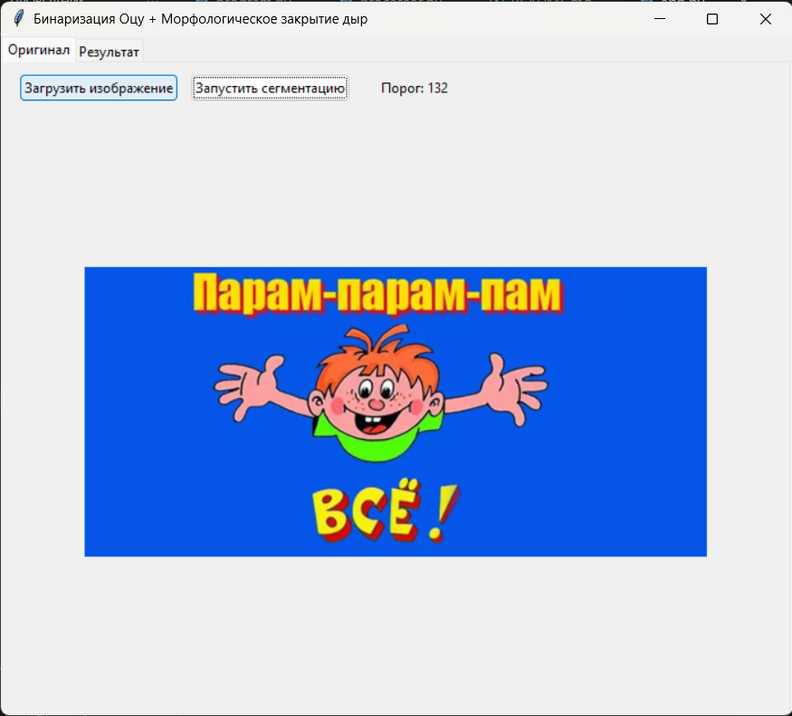
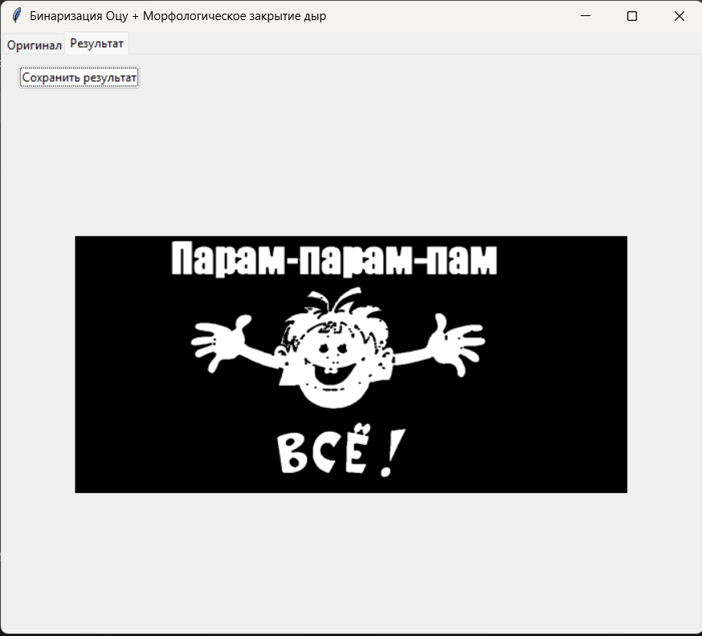

# Бинаризация Оцу + Морфологическое закрытие дыр

Приложение для автоматической бинаризации изображений методом Оцу с последующим
морфологическим закрытием для заполнения чёрных пустот внутри объектов.

## Возможности

- Загрузка изображения (поддерживаются JPG, PNG, BMP, TIFF).
- Автоматическое вычисление порога бинаризации методом Оцу.
- Морфологическое закрытие (эллиптическое ядро 5x5) для устранения чёрных пустот.
- Отображение вычисленного порога в интерфейсе.
- Предпросмотр исходного и обработанного изображений.
- Сохранение результата в PNG или JPEG.

## Установка зависимостей

```bash
python3 -m venv .venv
source .venv/bin/activate  # для Linux/macOS
# или .venv\Scripts\activate  # для Windows
pip install -r requirements.txt
```

## Запуск

```bash
python3 app.py
```

## Использование

1) Перейдите на вкладку Оригинал и нажмите Загрузить изображение.
2) После загрузки нажмите Запустить сегментацию — в интерфейсе отобразится вычисленный порог.
3) Перейдите на вкладку Результат, чтобы увидеть обработанную бинарную маску.
4) При необходимости нажмите Сохранить результат и укажите путь для сохранения.

## Скриншоты

Ниже приведены примеры работы приложения.

### Вкладка «Загрузка»



### Вкладка «Тепловой фильтр»


